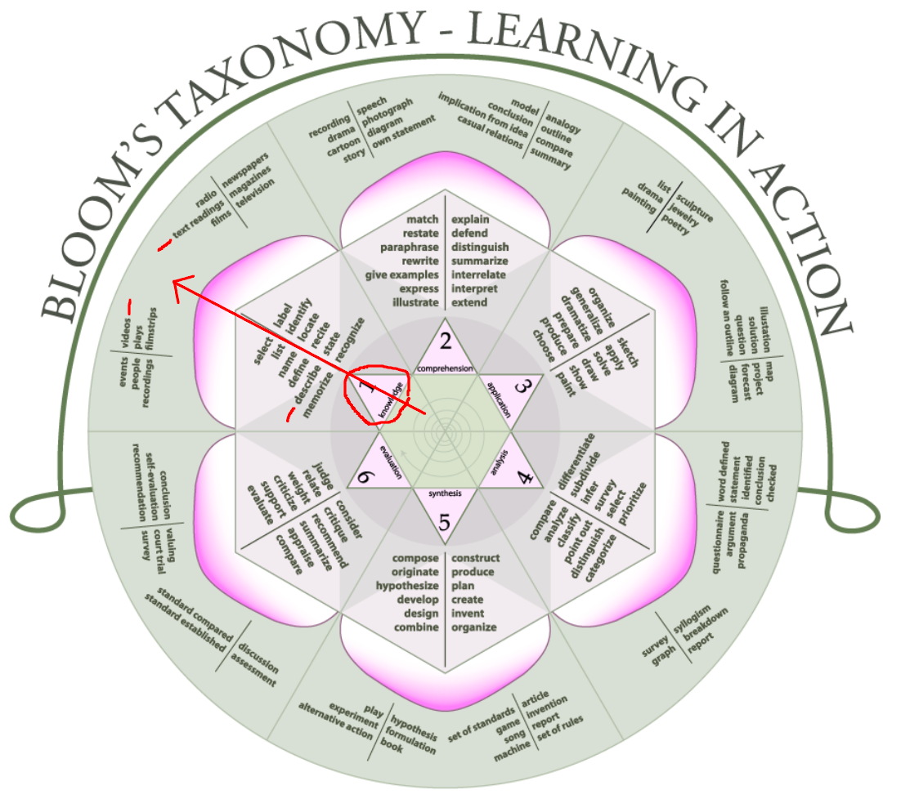

# Avant de commencer

Avant de vous salir les mains et de commencer à créer un module d'apprentissage en ligne, une vidéo ou quoi que ce soit d'autre, prenez du recul et réfléchissez. Plus vous vous préparez **en amont**, plus le processus de création sera rapide.

## Définir les objectifs

Quel est l'objet de la formation ? Qui sont vos **expertes métier**, en anglais : **Subject Matter Expert** (**SME**) ou votre groupe de travail ? Qui est le public cible ? Afin de trouver des objectifs de cours appropriés, veuillez vous référer à la [Taxonomie de Bloom] (https://www.bloomstaxonomy.net/). Cela vous aidera à définir les objectifs de votre cours avec des **verbes d'action**. Si possible, vous devriez également interviewer et observer les apprenants cibles dans leur environnement de travail afin de saisir les subtilités de leurs besoins.

Si vos apprenants ont besoin de savoir quelque chose, ne dites pas : "A la fin du cours, vous **connaîtrez** la gestion du CERN". Vous devriez dire : "A la fin du cours, vous serez capable de **décrire** la gestion du CERN".

Après avoir suivi votre module d'apprentissage en ligne, les participants devraient être en mesure de **réaliser des actions** liées à leur **travail**. Pour les connaissances brutes, veuillez lire un livre :wink :.

### Exemple

Comme vous pouvez le voir dans cet exemple, en partant du centre de la fleur de la taxonomie de Bloom, vous avez décidé que **la connaissance** décrit le mieux le contenu de votre cours.

Sachant cela, vous pouvez énoncer l'objectif suivant : *A la fin de ce module, vous devriez être capable de **décrire** le processus de recrutement du CERN.*

Compte tenu de cet objectif, vous opterez probablement pour un format texte, par exemple un article en ligne sur [admin e-guide](https://admin-eguide.web.cern.ch).

Une vidéo est également appropriée, mais le "making of" est beaucoup plus long et plus technique que la rédaction d'un article. Tenez compte de votre calendrier et des efforts à mettre en œuvre avant de choisir l'option qui vous semble la plus intéressante. Le jeu en vaut-il la chandelle ?

## Définir le public cible

**Qui sont vos apprenants** ? Les scientifiques pourraient préférer les cours magistraux, tandis que les ingénieurs pourraient préférer les activités pratiques. Le module d'apprentissage en ligne obligatoire sur l'évacuation d'urgence suscite des réactions mitigées : certains le trouvent puéril, d'autres l'adorent pour son interactivité et sa narration. Il n'est pas possible de plaire à tout le monde ! Lors de l'évaluation des compétences, demandez-vous : **est-ce que tout le monde est capable d'atteindre les objectifs** ? Si oui, le cours a rempli les objectifs.

Ne croyez pas toujours les **SME** sur parole. Allez dans l'environnement des apprenants et observez comment ils travaillent. Interrogez-les pour comprendre leurs besoins et adaptez les objectifs et le contenu à ce qu'ils doivent réaliser. Ont'ils accès à un ordinateur pour une formation en ligne ? Si ce n'est pas le cas, une formation en ligne n'a que très peu d'intérêt pour eux.

Vous n'aurez probablement pas besoin d'expliquer les détails de l'électronique de l'accélérateur à des physiciens. Ils préféreraient voir quelques formules de calcul de l'énergie nécessaire à une expérience.

Les ingénieurs en électronique n'ont probablement pas besoin de connaître la signification des données mesurées par Atlas, mais ils doivent les câbler correctement :scream:.

En bref : vous devez adapter votre contenu à votre public. Les connaissances supplémentaires ne sont pas interdites, mais le contenu principal doit être **pertinent pour le travail et pour l'individu**.

## Rassembler le contenu du cours

Demandez à vos **SME** de fournir le contenu du cours. Vous n'êtes pas les **SME**. Cela vous prend trop de temps de deviner ce qui doit être dit sur la diapositive XX à YY minutes ZZ secondes.

De plus, vous risqueriez de passer à côté du message clé ou de donner un message erroné. Il est plus long de demander aux **SME** de réviser et de corriger que de recevoir le contenu correct dès le début. Il y aura toujours un besoin de correction plus tard, c'est pourquoi vous préfèrerez réduire les aller-retours dès le début du processus de conception.

Vous pouvez demander aux **SME** de vous donner le cours comme si vous étiez un apprenant dans une salle de classe. Laissez les **SME** lire la présentation Powerpoint ou le matériel de cours et vous l'expliquer. Prenez des notes, enregistrez ce cours. Plus vous en savez avant de commencer à créer quoi que ce soit, plus les choses iront vite et plus elles seront faciles par la suite. Il s'agit de gagner du temps sur la conception.

Extrayez les messages clés, résumez les sujets, imaginez les interactions, réfléchissez à la meilleure façon de tester les connaissances de l'apprenant, rassemblez les ressources visuelles (images, vidéos, audio). Vous n'êtes pas un expert dans tous les domaines, alors demandez l'aide des **SME**, mettez-les au défi et poussez-les à se concentrer sur ce qui est vraiment essentiel et pertinent. Les **SME** peuvent souhaiter que tout soit couvert dans leur cours. Ce n'est pas forcément nécessaire, ni souhaitable.

Si les **SME** ne peuvent pas proposer de cours sur le sujet, vous n'aurez pas besoin de passer du temps à créer quoi que ce soit. Il ne s'agit pas d'un problème de formation.

## Choisissez vos outils

Maintenant que vous savez QUOI et QUI, vous pouvez vous demander COMMENT ?

Cette question est cruciale. Il y a des cas où un e-learning n'est pas approprié ! Trop de travail pour un petit résultat, il n'y a pas d'objectifs d'apprentissage, la connaissance est mieux transmise d'une autre manière sont des situations possibles où vous éviterez d'investir du temps dans un e-learning.

Si l'objectif est de pouvoir planifier des vacances sur EDH, il est peut-être préférable d'avoir des boutons d'aide dans le formulaire EDH pour vous guider. Vos collègues peuvent également vous montrer comment réserver vos journées en un rien de temps.

Si l'objectif est de pouvoir commander 15 tonnes de poudre magique® en respectant les règles d'achats du CERN, en donnant des informations pertinentes sur le fournisseur et sur tout cadre juridique sous-jacent à la commande (et il y en a beaucoup !), alors un cours pourrait être une bonne idée afin de former tout le monde à avoir la même capacité. Peut-être qu'une formation en classe serait préférable à une formation en ligne ?
