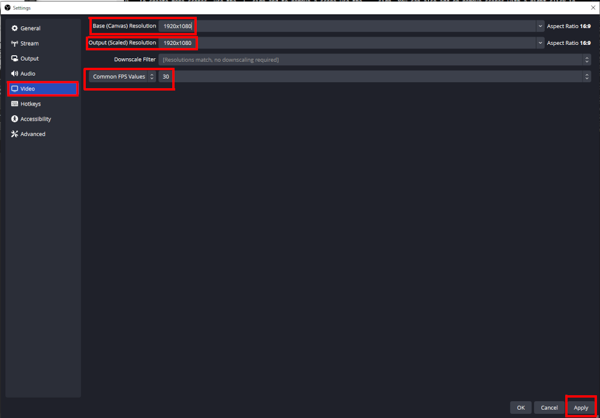

# Recording a video

Choose this option in case you identified that the video format is fitting your training needs. If you are not sure how to define your needs, please consult the [Before you begin](./../page2/begin.en.md) page.

You can also consult the [IT e-Learning](https://it-e-learning.docs.cern.ch/) documentation if the present documentation does not fit your use case.

If you need any further help, please contact `technical.training@cern.ch`

**Please note that HR-LD is not a technical help desk and will not be able to help you install and configure your recording machine for you.**

## Expected workload

**Simple video** (screen recording, face filming no interaction)

15 hours of work : 5 minutes of video

(including scripts and planification)

**Video with simple animations** (translation of objects)

25 hours of work : 5 minutes of video

(depending the complexity and quantity of animations)

**Video with complex animations and effects**

More than 50 hours of work : 5 minutes of video

Please make sure that the appropriate tools are available at CERN before requestiong complex video production. If not, prepare a budget for an external provider.

*[Source and help](https://it-e-learning.docs.cern.ch/)*

## Preparation

Before opening your recording software, plugging your microphone and starting your recording, you need a bit of preparation and planning.
**The better you prepare, the faster your recording session will be**. Do not neglect or underestimate this step.

### Transcript

If you plan on going fully on improvisation, you may have a difficult time keeping your speech fluent and clear.

#### Write it

Write a transcript of your course.
The transcript is the exact written transcription of what you will say in your video. Think of it as the script of a theatre play.
Having this script will help you reduce the amount of *"huuuuum.... eeeerrrr..."* and other bad language habits that we have in our everyday discussions.

Question to help you:

* If I was to give this talk in an auditorium, what would I **exaclty** say?

##### Vocabulary in your transcript

Keep it easy, simple to pronounce and in shorter sentences. You want to keep your learner's attention, not lose it. The easier it is for you to pronounce, the less retake you will need to correct a failed recording attempt.

##### Subtitles

Take into consideration the fact that putting subtitles in your video is an accessibility concern. If your speech is written, it can be converted to subtitles right away! It is also much easier to translate, if needed!!!

**This is why writing a transcript is the n°1 step to do before recording a video.**

#### Memorize it

Take the time to memorize your script as much as possible. If you are filmed, learners will notice that you are always looking away to read your script. If you are not filmed, this will be more comfortable for you to speak fluently if you know what you will say instead of reading and discovering it live.

#### Train yourself

Train yourself in front of the mirror or in your personal zoom room. **Record yourself** first and **rewatch your performance**.

* How is your voice?
* How is your speech?
* Are you looking at the camera?
* Do you feel that you have a presence?

#### Look at the camera; speak without hesitation

In face to face chats, eye contact is critical to keep your listener hooked to your speech. In a video that is delivered online, this is even more critical since you are not present in the room with the learner.
If you are speaking in an auditorium, you can't possibly look at every single attendee in the eyes. This is the same if you do not film yourself in your video. In this case, your voice is all that's left to keep the learner's attention.

### Recording equipment

#### Room

**Technical training** can make a room available for you in the training centre [Building 593](https://maps.web.cern.ch/?xmin=2492303.5&ymin=1121041.55&xmax=2493041.69&ymax=1121665.44&basemap=plan&mode=2D). Please take into account the possible reservation delay.

If you have more specific needs, you may ask the audio-video team (IR-ECO) if you can book a room in [Building 510](https://maps.web.cern.ch/?xmin=2492969.96&ymin=1120752.12&xmax=2493339.05&ymax=1121064.06&basemap=plan&mode=2D). **HR-LD can't provide support in this case**.

If you need to find a quiet room to do your recording. Here are some guidelines:

* a small room, to reduce the echo of your voice
* a room in which you will not be disturbed
* away from a high trafic road or corridor
* not too far for you to bring your equipment

#### Computer

**Technical training** can provide you with a desktop computer dedicated to recording in a room of the **training centre: Building 593**. Please ask for permission before installing any software on this machine.
**Windows 11 and CentOS 8** are the only distributions available.
**This computer is static and cannot be brought to your office or another recording room**.

If you are using your own computer to do the recording, you should install a [recording software](#recording-software). Technical support from HR-LD is limited in this case.

#### Microphone

**Technical training** can provide you with a USB microphone. No further software is needed to run it. Just plug it to your computer and it works. This microphone is in a dedicated room in the **training centre**. If you need to borrow it to record in another room, please contact **technical training** and provide sufficient **justification**.

If you wish to use your own microphone, please refrain using a headset microphone or the laptop microphone. The recording quality would be very low and will be a dealbreaker for your learners...
Prefer using tabletop or studio microphones.

#### Webcam

**Technical training** can provide you with a USB FHD webcam (recording at 1920 x 1080). No further software is needed to run it. Just plug it to your computer and it works. This webcam is in a dedicated room in the **training centre**. If you need to borrow it to record in another room, please contact **technical training** and provide sufficient **justification**.

If you wish to use your own webcam, please refrain using the laptop webcam. The recording quality would be very low and will be a dealbreaker for your learners...
Prefer using external USB webcams and make sure that it is at least recording at *Full HD* (FHD 1920 x 1080).

#### Background

If you need to use a webcam to record yourself, you may need to use a green background and lights to create a neutral background or to interact with your content.

**Technical training** can provide you with a green screen and two table top lights. They are located in a dedicated room in the **training centre**. If you need to borrow it to record in another room, please contact **technical training** and provide sufficient **justification**.

### Recording software

We recommend you to use [OBS Studio](https://obsproject.com/) as your video recording software. It is **free**, **open source**, and available on **all platforms! (windows, mac, linux)**

If you have a licence or are more conformtable with another software, such as Camtasia, you are free to use it.

#### Interface

1- **Canvas**

All elements in the canvas will appear in your final video. All captured element (windows, screen, webcam, picture, ...) can be dragged in this area. You can also resize them using the red dots on the sides of a selected object (as you would do in PowerPoint, for instance).

2- **Scenes**

You can setup several scenes in this area. You may need to create a scene with a webcam in full screen and another scene with a window in full screen and the webcam smaller in a corner of the screen.

To create more scenes, use the `+` sign and to remove a scene use the `-` sign. You can also add or remove scenes with a right click in this panel.
**Make sure to name your scenes something relevant and recognizable for you**.

The `up` and `down` arrows let you order your scenes as you please.

3- **Sources**

The sources that you wish to record.

In this example, a *Window capture* records a single opened window on your desktop (the same as ZOOM would do if you share a window). As you can see, the notepad element at the lower left corner of the canvas does not appear on the captured scree above, because it was on a secondary screen on my computer.

The *Display capture* element is capturing my full screen (again, the same as ZOOM would do if you share your screen). As you can see, there is another notepad with a different text. This notepad was appearing in the screen that I was recording.

To record more sources, use the `+` sign and to remove a source use the `-` sign. You can also add or remove sources with a right click in this panel.
**Make sure to name your sources something relevant and recognizable for you**.

**Order matters!**
The `up` and `down` arrows let you order your sources as you please. The source appearing higher on the list is displayed above the others in your videos. You can imagine to put a *Display capture* at the lower level and size it to fill the canvas completely and add a *Video capture device* to record your webcam above the *Display capture*. If you leave the webcam below the screen recording in the **Sources** list, then your webcam is hidden by your screen!

The `cog` icon lets you apply some more filters on the sources. This will not be covered by this guide. Feel free to explore by yourself.

4- **Audio Mixer**

*Desktop audio* refers to any sound recorded by your applications (sound from your web browser, media player, others).
*Mic/Aux* refers to your microphone.

You can use this panel to adjust the volume of these elements and mute them. In this example, both audio sources are muted, as you can see with the red icon on the right.

The `cog` icon lets you apply some more filters on the audio. This will not be covered by this guide. Feel free to explore by yourself.

5- **Control panel**

In your use case at CERN, the `Start recording` button is the only relevant option. The streaming option needs specific setup to live stream on youtube, facebook, twitch and other platforms. This will not be covered here.

The `Settings`button lets you setup the parameters for video recording and saving location.

#### Settings

**Please do not modify the recording settings on the computer at training centre.**

If you are using your own computer to record, you can use the settings below:

You can select the folder where the videos will be saved in the `output` panel. Select a place that is convenient for you (default is the `Videos` folder). All videos will always be saved in this folder until you decide to change it.

You can select the resolution of the video output in the `video` panel.

`Base (Canvas) Resolution` refers to the **1- Canvas** in on the OBS [interface](#interface). If your computer struggles to render the canvas or if you notice a performance drop, you may want to lower the resolution of the canvas.

`Output (Scaled) Resolution` refers to the resolution your video will be recorded at. It is better that you keep it at 1920x1080 since it is the common size of most computer screens. The webcam at **training centre** is recording at this resolution. It is advised that you avoid going lower on the resolution as it will lower the quality of you video when played on a wide screen.

`Common FPS values` is referring to the *Frames Per Seconds*. 30 FPS is a good compromise and you should not need to record at higher FPS in the context of a training recording.

