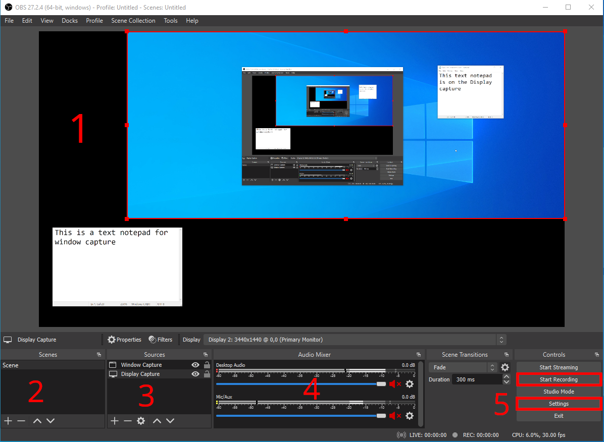
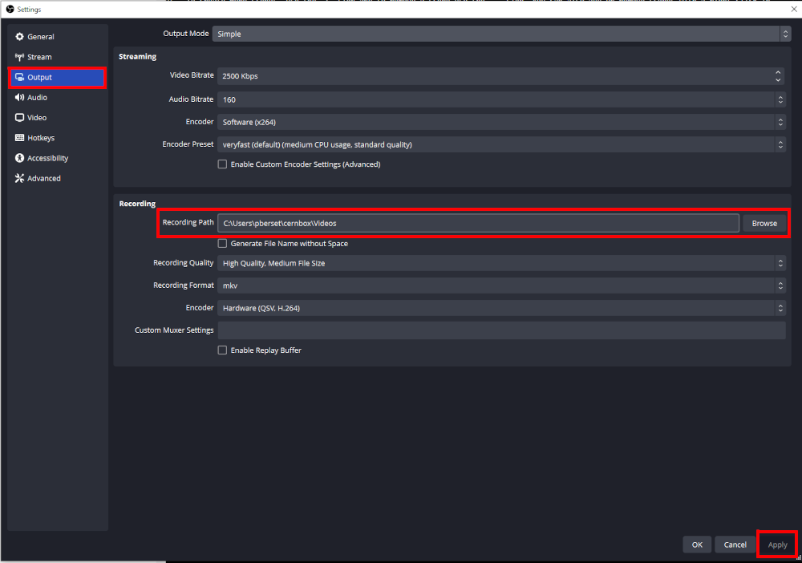

# Enregistrer une vidéo

Choisissez cette option si vous avez identifié que le format vidéo correspond à vos besoins de formation. Si vous ne savez pas comment définir vos besoins, veuillez consulter la page [Avant de commencer](./../page2/begin.fr.md).

Vous pouvez également consulter la documentation [IT e-Learning](https://it-e-learning.docs.cern.ch/) si la documentation actuelle ne correspond pas à votre cas d'utilisation.

Si vous avez besoin d'aide supplémentaire, veuillez contacter `technical.training@cern.ch`

**Veuillez noter que HR-LD n'est pas un service d'assistance technique et ne sera pas en mesure de vous aider à installer et à configurer votre machine d'enregistrement à votre place.

## Charge de travail attendue

**Vidéo simple** (enregistrement d'écran, filmage de face, pas d'interaction)

15 heures de travail : 5 minutes de vidéo
(y compris les scripts et la planification)

**Vidéo avec animations simples** (déplacements d'objets)

25 heures de travail : 5 minutes de vidéo
(en fonction de la complexité et de la quantité d'animations)

**Vidéo avec animations et effets complexes** (effets visuels, personnages animés)

Plus de 50 heures de travail : 5 minutes de vidéo

Veuillez vous assurer que les outils appropriés sont disponibles au CERN avant de demander une production vidéo complexe. Si ce n'est pas le cas, préparez un budget pour un prestataire externe.

*[Source et aide](https://it-e-learning.docs.cern.ch/)*

## Préparation

Avant d'ouvrir votre logiciel d'enregistrement, de brancher votre microphone et de commencer votre enregistrement, vous avez besoin d'un peu de préparation et de planification.

**Plus vous vous préparez, plus votre session d'enregistrement sera rapide**. Ne négligez pas ou ne sous-estimez pas cette étape.

### Script

Si vous prévoyez de vous lancer entièrement dans l'improvisation, vous risquez d'avoir du mal à garder votre discours fluide et clair.

#### Rédigez-le

Rédigez une script de votre cours.

Le script est la transcription écrite exacte de ce que vous direz dans votre vidéo. Pensez-y comme au script d'une pièce de théâtre.

Ce script vous aidera à réduire le nombre de *"huuuuum.... eeeeuuuuuhhh... "* et d'autres mauvaises habitudes de langage que nous avons dans nos discussions de tous les jours.

Question pour vous aider :

* Si je devais donner cette conférence dans un auditorium, que dirais-je **exactement** ?

##### Vocabulaire dans votre script

Le vocabulaire doit être simple, facile à prononcer et en phrases courtes. Vous voulez garder l'attention de votre apprenant, pas la perdre. Plus le texte est facile à prononcer, moins vous aurez à le reprendre pour corriger une tentative d'enregistrement ratée.

##### Sous-titres

Tenez compte du fait que l'insertion de sous-titres dans votre vidéo est une question d'accessibilité. Si votre discours est écrit, il peut être converti en sous-titres immédiatement ! Il est également beaucoup plus facile de le traduire, si nécessaire !

**C'est pourquoi la rédaction d'un script est l'étape n°1 à réaliser avant l'enregistrement d'une vidéo.

#### Mémorisez-le

Prenez le temps de mémoriser votre texte autant que possible. Si vous êtes filmé, les apprenants remarqueront que vous regardez toujours ailleurs pour lire votre texte. Si vous n'êtes pas filmé, il vous sera plus facile de parler couramment si vous savez ce que vous allez dire au lieu de lire et de découvrir votre texte en direct.

#### Entraînez-vous

Entraînez-vous devant le miroir ou dans votre salle de zoom personnelle. **Enregistrez-vous** d'abord et **regardez votre performance**.

* Comment est votre voix ?
* Comment est votre discours ?
* Regardez-vous la caméra ?
* Avez-vous l'impression d'avoir une présence ?

#### Regardez la caméra ; parlez sans hésitation

Dans les discussions en face à face, le contact visuel est essentiel pour que l'auditeur reste accroché à votre discours. Dans une vidéo diffusée en ligne, c'est encore plus important car vous n'êtes pas présent dans la salle avec l'apprenant.

Si vous parlez dans un auditorium, vous ne pouvez pas regarder chaque participant dans les yeux. Il en va de même si vous ne vous filmez pas dans votre vidéo. Dans ce cas, il ne reste plus que votre voix pour retenir l'attention de l'apprenant.

### Matériel d'enregistrement

#### Salle

**Technical Training** peut mettre une salle à votre disposition dans le centre de formation [Bâtiment 593](https://maps.web.cern.ch/?xmin=2492303.5&ymin=1121041.55&xmax=2493041.69&ymax=1121665.44&basemap=plan&mode=2D). Veuillez tenir compte d'un potentiel délai de réservation.

Si vous avez des besoins plus spécifiques, vous pouvez demander à l'équipe audio-vidéo (IR-ECO) si vous pouvez réserver une salle dans le [bâtiment 510](https://maps.web.cern.ch/?xmin=2492969.96&ymin=1120752.12&xmax=2493339.05&ymax=1121064.06&basemap=plan&mode=2D). **HR-LD ne peut pas fournir d'assistance dans ce cas**.

Si vous avez besoin de trouver une salle calme pour faire votre enregistrement. Voici quelques conseils :

* une petite pièce, pour réduire l'écho de votre voix
* une pièce dans laquelle vous ne serez pas dérangé
* loin d'une route ou d'un couloir à forte circulation
* pas trop loin pour que vous puissiez apporter votre matériel

#### Ordinateur

**Technical Training** peut mettre à votre disposition un ordinateur de bureau dédié à l'enregistrement dans une salle du **centre de formation : Bâtiment 593**. Veuillez demander l'autorisation avant d'installer un logiciel sur cette machine.

**Windows 11 et CentOS 8** sont les seules distributions disponibles.

**Cet ordinateur est statique et ne peut pas être apporté dans votre bureau ou dans une autre salle d'enregistrement**.

Si vous utilisez votre propre ordinateur pour effectuer l'enregistrement, vous devez installer un [logiciel d'enregistrement](#recording-software). L'assistance technique de HR-LD est limitée dans ce cas.

#### Microphone

**Technical Training** peut vous fournir un microphone USB. Aucun autre logiciel n'est nécessaire pour le faire fonctionner. Il suffit de le brancher sur votre ordinateur pour qu'il fonctionne. Ce microphone se trouve dans une salle réservée à cet effet dans le **centre de formation**. Si vous avez besoin de l'emprunter pour enregistrer dans une autre salle, veuillez contacter **Technical Training** et fournir une **justification** suffisante.

Si vous souhaitez utiliser votre propre microphone, veuillez vous abstenir d'utiliser un casque-microphone de communication ou le microphone de votre ordinateur portable. La qualité de l'enregistrement serait très faible et constituerait un obstacle pour vos apprenants...

Préférez l'utilisation de microphones de table ou de studio.

#### Webcam

**Technical Training** peut vous fournir une webcam USB FHD (enregistrement à 1920 x 1080). Aucun autre logiciel n'est nécessaire pour la faire fonctionner. Il suffit de la brancher sur votre ordinateur pour qu'elle fonctionne. Cette webcam se trouve dans une salle dédiée du **centre de formation**. Si vous avez besoin de l'emprunter pour enregistrer dans une autre salle, veuillez contacter **Technical Training** et fournir une **justification** suffisante.

Si vous souhaitez utiliser votre propre webcam, veuillez ne pas utiliser la webcam de votre ordinateur portable. La qualité de l'enregistrement serait très faible et constituerait un obstacle pour vos apprenants...

Préférez utiliser des webcams USB externes et assurez-vous qu'elles enregistrent au moins en *Full HD* (FHD 1920 x 1080).

#### Arrière-plan

Si vous devez utiliser une webcam pour vous enregistrer, vous aurez peut-être besoin d'un fond vert et de lumières pour créer un arrière-plan neutre ou pour interagir avec votre contenu.

**Technical Training** peut vous fournir un écran vert et deux éclairages de table. Ils se trouvent dans une salle réservée à cet effet dans le **centre de formation**. Si vous avez besoin de les emprunter pour enregistrer dans une autre salle, veuillez contacter **Technical Training** et fournir une **justification** suffisante.

### Logiciel d'enregistrement

Nous vous recommandons d'utiliser [OBS Studio](https://obsproject.com/) comme logiciel d'enregistrement vidéo. Il est **gratuit**, **open source**, et disponible sur **toutes les plateformes ! (windows, mac, linux)**

Si vous disposez d'une licence ou si vous êtes plus à l'aise avec un autre logiciel, tel que Camtasia, vous êtes libre de l'utiliser.

#### Interface

1- **Canvas**

Tous les éléments du canevas apparaîtront dans votre vidéo finale. Tous les éléments capturés (fenêtres, écran, webcam, image, ...) peuvent être glissés dans cette zone. Vous pouvez également les redimensionner en utilisant les points rouges sur les côtés d'un objet sélectionné (comme vous le feriez dans PowerPoint, par exemple).

2- **Scènes**

Vous pouvez configurer plusieurs scènes dans cette zone. Vous pouvez avoir besoin de créer une scène avec une webcam en plein écran et une autre scène avec une fenêtre en plein écran et la webcam plus petite dans un coin de l'écran.

Pour créer d'autres scènes, utilisez le signe `+` et pour supprimer une scène, utilisez le signe `-`. Vous pouvez également ajouter ou supprimer des scènes en faisant un clic droit dans ce panneau.

**Veillez à donner à vos scènes un nom pertinent et reconnaissable pour vous**.

Les flèches `haut` et `bas` vous permettent d'ordonner vos scènes comme vous le souhaitez.

3- **Sources**

Les sources que vous souhaitez enregistrer.

Dans cet exemple, une *Window capture* enregistre une seule fenêtre ouverte sur votre bureau (comme le ferait ZOOM si vous partagiez une fenêtre). Comme vous pouvez le constater, l'élément bloc-notes situé dans le coin inférieur gauche du canvas n'apparaît pas sur l'écran capturé ci-dessus, car il se trouvait sur un écran secondaire de mon ordinateur.

L'élément *Display capture* capture mon écran complet (comme le ferait ZOOM si vous partagiez votre écran). Comme vous pouvez le voir, il y a un autre bloc-notes avec un texte différent. Ce bloc-notes apparaissait dans l'écran que j'enregistrais.

Pour enregistrer plus de sources, utilisez le signe `+` et pour supprimer une source, utilisez le signe `-`. Vous pouvez également ajouter ou supprimer des sources en faisant un clic droit dans ce panneau.

**Veillez à donner à vos sources un nom pertinent et reconnaissable pour vous**.

**L'ordre est important !**

Les flèches `haut` et `bas` vous permettent d'ordonner vos sources comme vous le souhaitez. La source qui apparaît en haut de la liste est affichée au-dessus des autres dans vos vidéos. Vous pouvez imaginer de placer une *Display capture* au niveau inférieur et de la dimensionner pour qu'elle remplisse complètement le canevas et d'ajouter un *Video capture device* pour enregistrer votre webcam au-dessus de la *Display capture*. Si vous laissez la webcam sous l'enregistrement de l'écran dans la liste **Sources**, votre webcam sera cachée par votre écran !

L'icône `rouage` vous permet d'appliquer d'autres filtres sur les sources. Ce sujet ne sera pas abordé dans ce guide. N'hésitez pas à l'explorer par vous-même.

4- **Mélangeur audio**

*Destop audio* désigne tout son enregistré par vos applications (son du navigateur web, du lecteur multimédia, etc.).

*Mic/Aux* fait référence à votre microphone.

Vous pouvez utiliser ce panneau pour régler le volume de ces éléments et les mettre en sourdine. Dans cet exemple, les deux sources audio sont coupées, comme le montre l'icône rouge à droite.

L'icône `rouage` vous permet d'appliquer d'autres filtres sur l'audio. Ce sujet n'est pas abordé dans ce guide. N'hésitez pas à l'explorer par vous-même.

5- **Panneau de contrôle**

Dans votre cas d'utilisation au CERN, le bouton `Start recording` est la seule option pertinente. L'option streaming nécessite une configuration spécifique pour diffuser en direct sur youtube, facebook, twitch et d'autres plateformes. Ce point ne sera pas abordé ici.

Le bouton `Settings` vous permet de configurer les paramètres pour l'enregistrement vidéo et l'emplacement de sauvegarde.

#### Paramètres

**Veuillez ne pas modifier les paramètres d'enregistrement sur l'ordinateur du centre de formation.**

Si vous utilisez votre propre ordinateur pour enregistrer, vous pouvez utiliser les paramètres ci-dessous :

Vous pouvez sélectionner le dossier dans lequel les vidéos seront sauvegardées dans le panneau de sortie. Sélectionnez l'endroit qui vous convient le mieux (par défaut, le dossier `Vidéos`). Toutes les vidéos seront toujours enregistrées dans ce dossier jusqu'à ce que vous décidiez de le changer.

Vous pouvez sélectionner la résolution de la sortie vidéo dans le panneau `video`.

La résolution de base (Canvas) fait référence au **1- Canvas** de l'[interface OBS](#interface). Si votre ordinateur a du mal à rendre le canevas ou si vous remarquez une baisse de performance, vous pouvez diminuer la résolution du canevas.

La résolution de sortie (mise à l'échelle) fait référence à la résolution à laquelle votre vidéo sera enregistrée. Il est préférable de la maintenir à 1920x1080, car c'est la taille habituelle de la plupart des écrans d'ordinateur. La webcam du **centre de formation** enregistre à cette résolution. Il est conseillé de ne pas descendre en dessous de cette résolution, car la qualité de la vidéo diminuera lorsqu'elle sera lue sur un grand écran.

`Common FPS values` fait référence aux *Images Par Seconde*. 30 IPS est un bon compromis et vous ne devriez pas avoir besoin d'enregistrer à des IPS plus élevés dans le contexte d'un enregistrement de formation.

