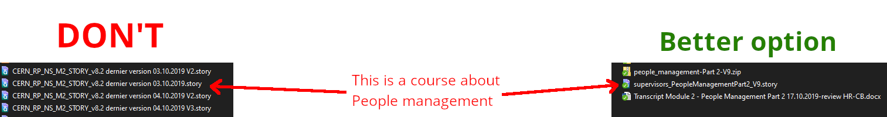
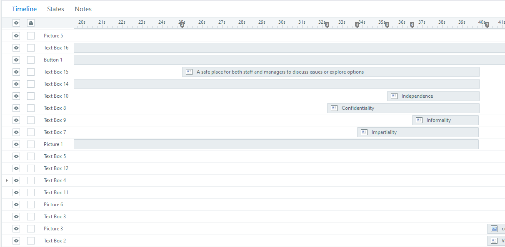
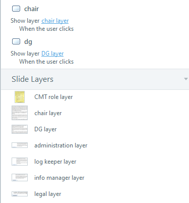
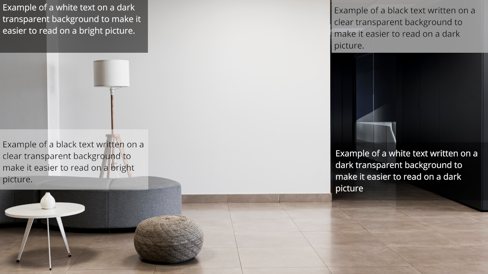
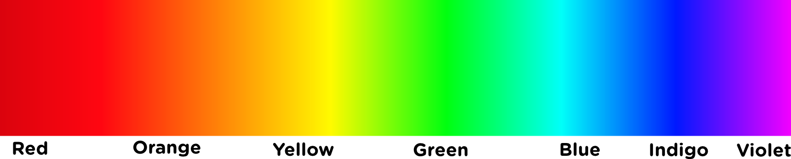
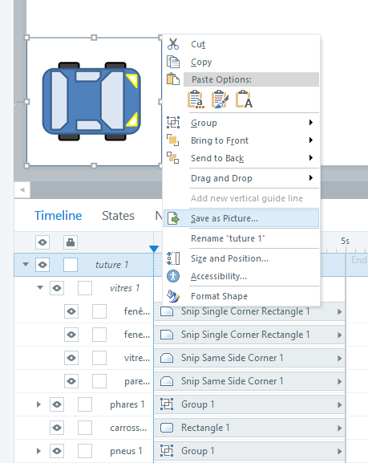

# Developing an e-Learning module

This documentation give e-Learning development advices for [Articulate Storyline 360](https://articulate.com/). Storyline 360 is the official authoring tool used by **HR-LD** and **HSE-TS** to create and maintain e-learning modules. If **HR-LD** or **HSE-TS** change their official tool, this document shall be updated accordingly.

This documentation should provide you with a Storyline template file and an assets folder that contains UI elements. There is also a PowerPoint template following the same design rules. The Storyline template contains the UI assets already placed in slides and *slide master* with expected triggers already set. You may adapt the usage to your specific needs. Any template modification is welcome and shall be documented.

## Expected workload

**Level 1 BASIC** (slideshow, without interactions)

* simplest -> 49 hours of work : 1 hour of e-learning
* average -> 79 hours of work : 1 hour of e-learning
* complex media production (voice over, graphics) -> 125 hours of work : 1 hour of e-learning

**Level 2 INTERACTIVE** (quizzes)

* simple media, templates -> 127 hours of work : 1 hour of e-learning
* average -> 184 hours of work : 1 hour of e-learning
* custom interactions, media, embeded simulations -> 267 hours of work : 1 hour of e-learning

**Level 3 ADVANCED, HIGH INTERACTIVE** (quizzes)

* templates, fast development -> 217 hours of work : 1 hour of e-learning
* average -> 490 hours of work : 1 hour of e-learning
* games, media production, simulation production -> 716 hours of work : 1 hour of e-learning

*[source](http://www.chapmanalliance.com/howlong/)*

## Template material

* [Project plan helper](./../files/e-learning-plans/E-Learning_Project_Plan.docx)
* [Storyboard helper](./../files/e-learning-plans/E-Learning_Storyboard.docx)
* [Powerpoint template for prototyping](./../files/ppt-template/e-learning.template.ppt.v-1-0-3-en.pptx)
* [.Story template (Storyline 360)](./../files/story-template/_0000_e-learning.layout-guides-16%2C9.v-0-0-3-en.story)
* Buttons [Illustrator file](./../files/buttons/Navigation_Buttons_SL3_final_02.ai) / [PNG files (zipped)](./../files/buttons/png/png.zip)
* Characters set [Illustrator file](./../files/adobe_files/01_CHARACTERS.v.0-0-2.ai) / [PNG files (zipped)](./../files/adobe_files/PNG/PNG.zip)
* [Animations example (Storyline 360)](./../files/animations_Opti/Animations_Opti.zip)
* [Articulate community files](https://gitlab.cern.ch/pberset/hr-ld-e-learning-guidelines/-/tree/master/docs/files/assets_community)

## Good practices

### Naming convention

In Storyline, as in many other tool. Objects you create have default names. Change them to something more… **explicit**!

Find examples below:

In the picture above, the name on the left (CERN_RP_NS_M2_STORY_v8.2 dernier version 03.10.2019 V2.story) does absolutely not tell you what the content is about. They are all *dernier version*? Which one is the latest? The name on the right (supervisors_PeopleManagementPart2_V9.story) may not be the best option, but at least, you can guess that it is the part 2 of the module People Management in the e-learning for supervisors, ninth version.

If your team is following another naming convention, of course comply with it, but make sure it is consistent and identifiable easily.

**In Storyline timeline view:** On the left of the picture above, the section names and slide names could be more explicit. On the right, it is easier to identify slides and chapters with their titles.

**Tip**: In the Storyline template’s slide master, the text area for the title is defined as “Title text”. This will automatically rename your slide in the hierarchy with the content of the text area.

The timeline above contains only objects with default names. Objects are not sorted. Such a timeline is giving you a difficult time if you need to perform an update.

Here, if you need to change an item that appears on the middle of the slide, you may have a visual hint on where to look for it. The names should help you to identify the content or purpose.

As you may notice on the two previous screenshots, there is a difference in the amount of objects on the slide. Avoid doing 4 minutes long timelines. You can use layers in Storyline. You may display or hide them with user inputs. You can also separate the content between multiple slides and play a transition animation if needed.

Of course, naming layers appropriately is important! Here the item *chair*, displays *chair layer* when clicked. Can you be more explicit?

### If you find it time consuming

Working with unlabelled content is **even more time consuming** and close to impossible. Renaming everything afterwards is very long and has no added value for the course itself! Save an e-learning designer. Label your objects clearly. :pray:

### General advice

You may have heard about learning styles like visual, auditory, or kinaesthetic. These are quite popular, but also referred as “Learning Myths”. Neurosciences have not yet proven the relevance of these theories. Mixing many ways to learn one topic is a way better approach, as the user will associate many thinking ways to obtain a single result, making the topic better understood. In the case of e-learnings, you are limited, but it is not impossible to propose a small hands-on activities with visual animations and audio sounds and voices. As much as possible, try to vary your approach and not stick to a single way to convey information.

You may also wish to avoid clicking for the only sake of clicking. You have the right to show some slides where no interactions is requested if the content does not provide a good opportunity for an activity. Of course, an interactive course is more interesting and you should take the time to think about the topic and how to make an activity out of it. No need to spend weeks on a single slide, though.

## Page template

Storyline shows a slide based presentation (such as PowerPoint). Any other tool that produces such kind of display shall respect the guidelines below. Focus on how to guide the user through the slide and how it should be read. Ask yourself: “What should the user see first?”.

* The slide dimension shall be 1920 x 1080 (16:9) *Full HD** format.
* The text font shall be Open Sans.
* The template has the Storyline default player buttons disabled (Next, Back, Submit, Menu).
* The slide’s title is shown at the top left corner of the slide. No header banner shall be used.
* The navigation buttons and help button are displayed at the bottom right of the slide and shall appear only when they are needed. No footer banner shall be used.

For a complete detail of the slide grid and font-size, please refer to the [template ppt and .story files](#template-material) slides 1.2 and 1.3.

### Explanations

* The slide dimension shall be 1920 x 1080 (16:9).

The 16:9 aspect ratio is the standard computer screen display. This choice saves time by avoiding to adapt the content to a different aspect ratio. The SME’s should be given the guideline to adapt their content to a 16:9 layout with the powerpoint template, if they wish to impose a slide design before production.

It is better to keep a big enough slide size in order to keep a good quality for pictures. The Learning Hub opens the e-learning as a pop up window, which is not full screen by default.

* The text font shall be Open Sans.

As specified in the [CERN design guidelines](https://design-guidelines.web.cern.ch/guidelines/typography) for online content. You may adapt the font size, colour and weight according to the situation. Keep it as easy to read as possible.

* The template has the Storyline default player buttons disabled (Next, Back, Submit, Menu).

The reason for that is that if we create navigation buttons ourselves, we may decide when they are available and when the user should perform any action before proceeding to the next slide. We prefer to avoid the menu button to limit the capacity of the user to jump to any slide without reading or performing a required action.

* The slide’s title is shown at the top left corner of the slide. No header banner shall be used.

The top left corner is the first place we look at on a window when looking for information. This is the standard occidental reading direction; courses at CERN are in French or English. We prefer to avoid any banner that takes the whole slide’s width in order to free more space for useful slide’s content.

* The navigation buttons and help button are displayed at the bottom right of the slide and shall appear only when they are needed. No footer banner shall be used.

The bottom right corner is the last place we look at when reading a slide. The user should view the slide before thinking about jumping to the next one. We avoid the footer banner for the same reason as we avoid a header banner. As specified before, you may decide whenever you wish to display or hide the navigation button and the exercise submit button. The help button shall be displayed each time a user needs to perform an action on the slide. This frees some space on the slide for the content. If the user does not understand straight away, the help button shows a small pop-up explaining what to do.

If you are using a tool that creates web based presentation (for instance [Articulate Rise](https://articulate.com/360/rise) or [Adapt Learning](https://www.adaptlearning.org/)) try to adapt the guidelines above as much as possible. You are not limited in height for your course, but avoid kilometres long web pages, otherwise your course may feel longer than it actually is. One topic per page is sufficient and better organised.

## Design advices

### Colour palette

*Good to know*: [White space is not your enemy](https://whitespacedesignbook.com). Do not be afraid to leave some breathing space in your slides.

The colour code for your course is better discussed with the **SME**. Some teams or projects at CERN may have an already defined colour palette. It is better to align with any existing guidelines when available in order to ensure a visual coherence between all the media the given topic is shared on (website, posters, booklets, etc.).

If you have no precision or the **SME** asks you to define the colour palette, you may align with the [CERN website design guidelines](https://design-guidelines.web.cern.ch/guidelines/colours). The template files have a colour palette set for HR-LD as a generic training colour palette. You may use it if you have no idea what your colour palette should be. For **safety** related content, the **HSE** colour palette is also available in the templates.

Keep in mind that the best option for an easy to read text is black letters on white background. That being said, if you are putting text on a picture, you might consider to add a transparent background-colour for your text to be readable over the background picture.

Example:

Source: [https://fr.freepik.com/photos/affaires](https://fr.freepik.com/photos/affaires) Affaires photo créé par freepik

You might also wish to put colours into your paragraph, to put emphasis on a word or sentence. The colours on the red side appear as being closer to the reader. The colours on the blue side may appear farther from the reader. If you use the CERN blue on your page, you might want to use a different blue tone to stay in the same side of the spectrum. However, using some orange might make the text pop-out in a very effective and dynamic way. Bold and underlined text is a discrete and effective way to draw the attention.

### CERN logo

CERN logo has [very specific guidelines](https://design-guidelines.web.cern.ch/guidelines/logo). Even though the e-learning modules are intended for internal use only, please respect the guidelines when using the CERN logo. You shall use it on the title page of your course, on the top right corner, for instance, respecting official margins.

### Pictures and graphics

**Before using a picture, make sure that you have the right to do so.**

Provide the sources next to your picture according to the citation rules specified on the platform you took the picture from.
You shall ask for permission to [CERN audio visual service](https://cern.service-now.com/service-portal?id=sc_cat_item&name=audiovisual-production-request&se=audiovisual-production) ([IR-ECO](https://international-relations.web.cern.ch/)) before taking photos in the CERN area. A CERN approved photograph may be mandated to take the pictures. Do not act on your own.

If you can not use `.svg` vector images, save them as `.emf` (best) or `.png/.jpg` before importing them to Storyline. You should ask the **SME** to provide as much pictures as possible. Your **SME** is the best person to give you topic related pictures.

You may find CERN related pictures on the [CERN Document Server](https://cds.cern.ch/).

You may ask IR-ECO to create icons for the course. Make sure you have a clear and precise demand as well as requesting your assets well in advance.

You may, of course create yourself the visual assets you need. If you have access to the Adobe suite, it is a valuable resource. Inkscape is a free open source vector image (.svg, .emf) editing software available on the CMF platform at CERN. You may also use GIMP for matrix image files (.jpg, .png) editing (Gimp project files are .xcf).

Storyline has the very same tools as PowerPoint to create shapes and has more options to animate them on mouse hover, on click or upon showing on the slide. Give it a chance and get inspired by the navigation buttons available in the template. You may export shapes to pictures in case you have built an object with several shapes.

Example:

A small car created with Storyline 3 shapes

As you can see, the car is a group of elements with sub groups. There are 11 elements to build this car. Keeping it like that on the slide and animating it will cause Storyline to slow down. The solution is to right click on the parent group and select “Save as picture”. Then, you may import the picture on the slide and remove the grouped shapes (or save them on a separate slide). Since this is a single element, you won’t suffer performance issues.

Creating assets from within Storyline saves you the need for external tools, you know how to use it and it gives you full credit to use it as you please. Of course, this might be more time consuming than using an drawing software such as illustrator or photoshop.

### *Timeless* design

By keeping the guidelines simple, this document encourages you to use as few fancy layout and colours as possible. There are two reasons for that:

1. E-Learning modules fit a specific role each depending on their topic and the **SME** reviewing them. By letting you very free on the design, this document doesn’t lock you in an uncomfortable situation, while giving you helpful advices to adapt your page layout to a common basis with other courses.

2. Graphic design is an ever evolving field. As most of the e-learning designers are not always graphic designer (maybe you aren’t even an e-learning designer!), this might be a lot of troubles to change an old looking design to a modern looking design. Keep it simple. Adapting every course content to a new trending design might mean remaking it from scratch. The less we do, the longer it will live.

We have created templates to spare your time. If the new generation decides that is time to invest in a new design, think about *timeless* again. At CERN, a template is there to last for many years.

### Humour (rude language)

[A website that will be responsive on any device, forever](https://motherfuckingwebsite.com/)

[A website with light styling that lets it be relevant for many years](https://bettermotherfuckingwebsite.com)

[A perfect website](https://perfectmotherfuckingwebsite.com/)

On a more serious note, these websites are a way to say that you should think carefully before making your design heavier with many elements that are in a fixed size and position on your page and may not be moved away. You’ll end up losing a lot of space for the core content of your course for the sake of the looks. The course hasn’t to be only black and white, but working with small touches makes them easier to maintain for years.

### Responsive design

*Responsive* means that your content will adapt to the window size. A website such as those in the previous chapter will display equally fine on a Desktop, laptop, or smartphone screen.

The Storyline player is responsive. The Storyline Slide is not. You may zoom in and out with touch-screen gestures on a smartphone, and you will need it. The slide size is fixed and by default your phone will try to display the full slide at the size of your screen. Storyline courses are not very convenient on Smartphones. Better on big Tablets and best on computer.

CERN users mainly have a laptop for work and even a desktop in offices. Smartphones are not specially used for work and a minority of users have a CERN smartphone. Therefore, responsiveness has not been considered in this document for now.

If you use a web based e-learning authoring tool, such as Rise or Adapt Learning, you will produce web-pages-like modules that will be responsive. [Adobe Captivate](https://www.adobe.com/fr/products/captivate.html) also has a *Flex-box* container option that adapts the text and slides elements to fit the screen size.
