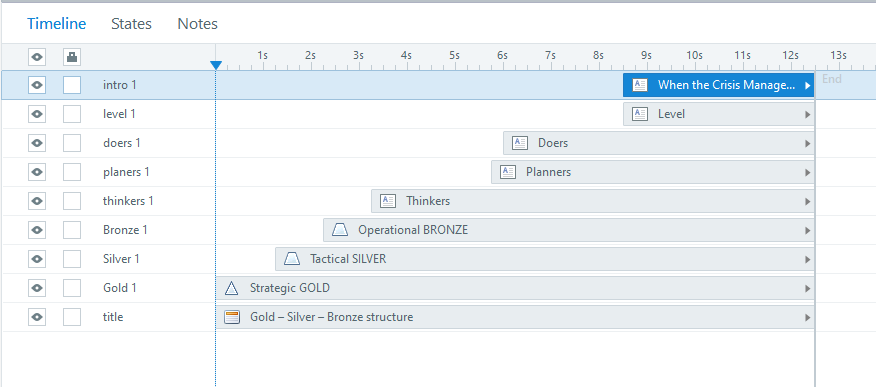
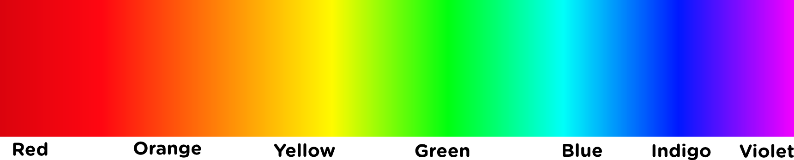

# Développer un module e-learning

Cette documentation donne des conseils de développement e-Learning pour [Articulate Storyline 360](https://articulate.com/). Storyline 360 est l'outil de création officiel utilisé par **HR-LD** et **HSE-TS** pour créer et maintenir des modules d'apprentissage en ligne. Si **HR-LD** ou **HSE-TS** changent d'outil officiel, ce document sera mis à jour en conséquence.

Cette documentation devrait vous fournir un fichier modèle Storyline et un dossier "assets" qui contient des éléments d'interface utilisateur. Il existe également un modèle PowerPoint qui suit les mêmes règles de conception. Le modèle Storyline contient les éléments de l'interface utilisateur déjà placés dans les diapositives et le *Master template* avec les déclencheurs prévus déjà définis. Vous pouvez adapter l'utilisation à vos besoins spécifiques. Toute modification du modèle est la bienvenue et doit être documentée.

## Charge de travail attendue

**Niveau 1 BASIC** (diaporama, sans interactions)

* le plus simple -> 49 heures de travail : 1 heure d'e-learning
* moyen -> 79 heures de travail : 1 heure d'e-learning
* production médiatique complexe (voix off, graphiques) -> 125 heures de travail : 1 heure d'e-learning

**Niveau 2 INTERACTIF** (quiz)

* médias simples, modèles -> 127 heures de travail : 1 heure d'e-learning
* moyenne -> 184 heures de travail : 1 heure d'e-learning
* interactions personnalisées, médias, simulations intégrées -> 267 heures de travail : 1 heure de e-learning

**Niveau 3 AVANCÉ, HAUTE INTERACTIVITÉ** (quiz)

* modèles, développement rapide -> 217 heures de travail : 1 heure de e-learning
* moyenne -> 490 heures de travail : 1 heure de e-learning
* jeux, production de médias, production de simulations -> 716 heures de travail : 1 heure d'e-learning

*[source](http://www.chapmanalliance.com/howlong/)*

## Modèles de référence

* [Aide au plan de projet](./../files/e-learning-plans/E-Learning_Project_Plan.docx)
* [Aide au storyboard](./../files/e-learning-plans/E-Learning_Storyboard.docx)
* [Modèle Powerpoint pour le prototypage](./../files/ppt-template/e-learning.template.ppt.v-1-0-3-fr.pptx)
* [Modèle .story (Storyline 360)](./../files/story-template/_0000_e-learning.layout-guides-16%2C9.v-0-0-3-fr.story)
* Boutons [Fichier Illustrator](./../files/buttons/Navigation_Buttons_SL3_final_02.ai) / [Fichiers PNG (zippés)](./../files/buttons/png/png.zip)
* Jeu de personnages [Fichier Illustrator](./../files/adobe_files/01_CHARACTERS.v.0-0-2.ai) / [Fichiers PNG (zippés)](./../files/adobe_files/PNG/PNG.zip)
* [Exemple d'animation (Storyline 360)](./../files/animations_Opti/Animations_Opti.zip)
* [Fichiers de la communauté Articulate](https://gitlab.cern.ch/pberset/hr-ld-e-learning-guidelines/-/tree/master/docs/files/assets_community)

## Bonnes pratiques

### Convention de nommage

Dans Storyline, comme dans beaucoup d'autres outils. Les objets que vous créez ont des noms par défaut. Changez-les pour quelque chose de plus... **explicite** !

Vous trouverez des exemples ci-dessous :

Dans l'image ci-dessus, le nom à gauche (CERN_RP_NS_M2_STORY_v8.2 dernière version 03.10.2019 V2.story) ne dit absolument pas de quoi parle le contenu. Ce sont toutes des *dernières versions* ? Laquelle est la plus récente ? Le nom de droite (supervisors_PeopleManagementPart2_V9.story) n'est peut-être pas la meilleure option, mais au moins, vous pouvez deviner qu'il s'agit de la partie 2 du module People Management dans la formation en ligne pour les superviseurs, neuvième version.

Si votre équipe suit une autre convention de dénomination, respectez-la bien sûr, mais veillez à ce qu'elle soit cohérente et facilement identifiable.

**Dans la vue "Timeline view" de Storyline :** À gauche de l'image ci-dessus, les noms des sections et des diapositives pourraient être plus explicites. À droite, il est plus facile d'identifier les diapositives et les chapitres avec leurs titres.

**Astuce** : Dans le "Master slide" du modèle Storyline fourni ici, la zone de texte pour le titre est définie comme "Title text". Cela renommera automatiquement votre diapositive dans la hiérarchie avec le contenu de la zone de texte.

La ligne de temps ci-dessus ne contient que des objets portant des noms par défaut. Les objets ne sont pas triés. Une telle ligne de temps vous donnera du fil à retordre si vous devez effectuer une mise à jour.

Ici, si vous devez modifier un élément qui apparaît au milieu de la diapositive, vous pouvez avoir un indice visuel sur l'endroit où vous devez le chercher. Les noms devraient vous aider à identifier le contenu ou l'objectif.

Comme vous pouvez le remarquer sur les deux captures d'écran précédentes, il y a une différence dans la quantité d'objets sur la diapositive. Évitez de faire des lignes de temps de 4 minutes. Vous pouvez utiliser des calques dans Storyline. Vous pouvez les afficher ou les masquer avec les entrées de l'utilisateur. Vous pouvez également séparer le contenu entre plusieurs diapositives et jouer une animation de transition si nécessaire.

Bien entendu, il est important de nommer les calques de manière appropriée ! Ici, l'élément *chair*, affiche le calque *chair* lorsqu'on clique dessus. Pouvez-vous être plus explicite ?

### Si vous trouvez que cela prend du temps

Travailler avec du contenu non étiqueté est **encore plus long** et presque impossible. Tout renommer plus tard est très long et n'a aucune valeur ajoutée pour le cours lui-même ! Sauvez un concepteur d'e-learning. Étiquetez clairement vos objets :pray:

### Conseils généraux

Vous avez peut-être entendu parler de styles d'apprentissage tels que le visuel, l'auditif ou le kinesthésique. Ces styles sont assez populaires, mais ils sont également qualifiés de "mythes de l'apprentissage". Les neurosciences n'ont pas encore prouvé la pertinence de ces théories. Mélanger plusieurs façons d'apprendre un sujet est une bien meilleure approche, car l'utilisateur associera plusieurs façons de penser pour obtenir un seul résultat, ce qui lui permettra de mieux comprendre le sujet. Dans le cas de l'apprentissage en ligne, vous êtes limité, mais il n'est pas impossible de proposer de petites activités pratiques avec des animations visuelles, des sons et des voix. Dans la mesure du possible, essayez de varier votre approche et de ne pas vous en tenir à une seule façon de transmettre l'information.

Vous pouvez également éviter de cliquer pour le seul plaisir de cliquer. Vous avez le droit de montrer certaines diapositives sans demander d'interaction si le contenu n'offre pas une bonne opportunité d'activité. Bien entendu, un cours interactif est plus intéressant et vous devez prendre le temps de réfléchir au sujet et à la manière d'en faire une activité. Il n'est cependant pas nécessaire de passer des semaines sur une seule diapositive.

## Modèle de page

Storyline offre une présentation basée sur des diapositives (comme PowerPoint). Tout autre outil qui produit ce type d'affichage doit respecter les lignes directrices ci-dessous. Concentrez-vous sur la façon de guider l'utilisateur à travers la diapositive et sur la façon dont elle devrait être lue. Posez-vous la question suivante "Qu'est-ce que l'utilisateur doit voir en premier" ?

* La diapositive doit être au format 1920 x 1080 (16:9) *Full HD**.
* La police de texte doit être Open Sans.
* Les boutons du lecteur par défaut de Storyline sont désactivés dans le modèle (Suivant, Précédent, Soumettre, Menu).
* Le titre de la diapositive est affiché dans le coin supérieur gauche de la diapositive. Aucune bannière d'en-tête ne doit être utilisée.
* Les boutons de navigation et le bouton d'aide sont affichés en bas à droite de la diapositive et ne doivent apparaître que lorsqu'ils sont nécessaires. Aucune bannière de bas de page ne doit être utilisée.

Pour plus de détails sur la grille des diapositives et la taille des polices, veuillez vous référer aux diapositives 1.2 et 1.3 du [modèle ppt et fichiers .story](#modèles-de-référence).

### Explications

* Les dimensions de la diapositive doivent être de 1920 x 1080 (16:9).

Le format 16:9 correspond à l'affichage standard d'un écran d'ordinateur. Ce choix permet de gagner du temps en évitant d'adapter le contenu à un format différent. Si les **SME** souhaitent imposer un design de diapositive avant la production, ils doivent recevoir des instructions pour adapter leur contenu à un format 16:9 à l'aide du modèle PowerPoint.

Il est préférable de conserver une taille de diapositive suffisamment grande afin de conserver une bonne qualité d'image. Le Learning Hub ouvre la formation en ligne dans une fenêtre pop up, qui n'est pas en plein écran par défaut.

* La police du texte doit être Open Sans.

Comme spécifié dans les [CERN design guidelines](https://design-guidelines.web.cern.ch/guidelines/typography) pour le contenu en ligne. Vous pouvez adapter la taille, la couleur et le poids de la police en fonction de la situation. Le texte doit être aussi facile à lire que possible.

* Les boutons du lecteur par défaut de Storyline sont désactivés dans le modèle (Suivant, Précédent, Soumettre, Menu).

La raison en est que si nous créons nous-mêmes les boutons de navigation, nous pouvons décider quand ils sont disponibles et quand l'utilisateur doit effectuer une action avant de passer à la diapositive suivante. Nous préférons éviter le bouton de menu pour limiter la capacité de l'utilisateur à sauter à n'importe quelle diapositive sans lire ou effectuer une action requise.

* Le titre de la diapositive est affiché dans le coin supérieur gauche de la diapositive. Aucune bannière d'en-tête ne doit être utilisée.

Le coin supérieur gauche est le premier endroit que nous regardons dans une fenêtre lorsque nous cherchons une information. C'est le sens de lecture occidental standard ; les cours au CERN sont en français ou en anglais. Nous préférons éviter les bannières qui prennent toute la largeur de la diapositive afin de libérer de l'espace pour le contenu utile de la diapositive.

* Les boutons de navigation et d'aide sont affichés en bas à droite de la diapositive et ne doivent apparaître que lorsqu'ils sont nécessaires. Aucune bannière de bas de page ne doit être utilisée.

Le coin inférieur droit est le dernier endroit que nous regardons lorsque nous lisons une diapositive. L'utilisateur doit consulter la diapositive avant de penser à passer à la suivante. Nous évitons la bannière de bas de page pour la même raison que nous évitons la bannière d'en-tête. Comme indiqué précédemment, vous pouvez décider d'afficher ou de masquer le bouton de navigation et le bouton de soumission de l'exercice. Le bouton d'aide doit être affiché chaque fois qu'un utilisateur doit effectuer une action sur la diapositive. Cela permet de libérer de l'espace sur la diapositive pour le contenu. Si l'utilisateur ne comprend pas tout de suite, le bouton d'aide affiche une petite fenêtre contextuelle expliquant ce qu'il faut faire.

Si vous utilisez un outil qui crée des présentations basées sur un format de page web (par exemple [Articulate Rise](https://articulate.com/360/rise) ou [Adapt Learning](https://www.adaptlearning.org/)), essayez d'adapter les lignes directrices ci-dessus autant que possible. Vous n'êtes pas limité en hauteur pour votre cours, mais évitez les pages web longues de plusieurs kilomètres, sinon votre cours pourrait sembler plus long qu'il ne l'est en réalité. Un sujet par page est suffisant et mieux organisé.

## Conseils de conception

### Palette de couleurs

*Bon à savoir* : [L'espace blanc n'est pas votre ennemi](https://whitespacedesignbook.com) (en Anglais). N'ayez pas peur de laisser un peu d'espace dans vos diapositives.

Il est préférable de discuter du code couleur de votre cours avec les **SME**. Certaines équipes ou certains projets au CERN peuvent avoir une palette de couleurs déjà définie. Il est préférable de s'aligner sur les lignes directrices existantes afin d'assurer une cohérence visuelle entre tous les supports sur lesquels le sujet est partagé (site web, affiches, brochures, etc.).

Si vous n'avez pas de précision ou si les **SME** vous demandent de définir la palette de couleurs, vous pouvez vous aligner sur les [lignes directrices pour la conception du site web du CERN](https://design-guidelines.web.cern.ch/guidelines/colours). Les fichiers modèles contiennent une palette de couleurs pour HR-LD comme palette de couleurs générique pour la formation. Vous pouvez l'utiliser si vous n'avez aucune idée de ce que devrait être votre palette de couleurs. Pour les contenus liés à la **sécurité**, la palette de couleurs **HSE** est également disponible dans les modèles.

Gardez à l'esprit que la meilleure option pour un texte facile à lire est d'utiliser des lettres noires sur fond blanc. Cela dit, si vous placez le texte sur une image, vous pouvez envisager d'ajouter une couleur de fond transparente pour que votre texte soit lisible sur l'image de fond.

Exemple :

Source : [https://fr.freepik.com/photos/affaires](https://fr.freepik.com/photos/affaires) Affaires photo créé par freepik

Vous pouvez également introduire des couleurs dans votre paragraphe, pour mettre l'accent sur un mot ou une phrase. Les couleurs du côté rouge semblent plus proches du lecteur. Les couleurs du côté bleu peuvent sembler plus éloignées du lecteur. Si vous utilisez le bleu du CERN sur votre page, vous voudrez peut-être utiliser un autre ton de bleu pour rester dans le même côté du spectre. Toutefois, l'utilisation d'un peu d'orange peut faire ressortir le texte de manière très efficace et dynamique. Le texte en gras et souligné est un moyen discret et efficace d'attirer l'attention.

### Logo du CERN

Le logo du CERN fait l'objet de [directives très spécifiques](https://design-guidelines.web.cern.ch/guidelines/logo). Même si les modules d'apprentissage en ligne sont destinés à un usage interne uniquement, veuillez respecter les directives relatives à l'utilisation du logo du CERN. Vous devez l'utiliser sur la page de titre de votre cours, dans le coin supérieur droit, par exemple, en respectant les marges officielles.

### Images et graphiques

**Avant d'utiliser une image, assurez-vous que vous en avez le droit.**

Indiquez les sources à côté de votre image selon les règles de citation spécifiées sur la plateforme à partir de laquelle vous avez pris l'image.

Vous devez demander l'autorisation au [service audiovisuel du CERN](https://cern.service-now.com/service-portal?id=sc_cat_item&name=audiovisual-production-request&se=audiovisual-production) ([IR-ECO](https://international-relations.web.cern.ch/)) avant de prendre des photos dans la zone du CERN. Un photographe agréé par le CERN peut être mandaté pour prendre les photos. N'agissez pas de votre propre chef.

Si vous ne pouvez pas utiliser les images vectorielles `.svg`, sauvegardez-les en `.emf` (le mieux) ou en `.png/.jpg` avant de les importer dans Storyline. Vous devriez demander aux **SME** de vous fournir autant d'images que possible. Vos **SME** sont les meilleures personnes pour vous donner des images liées au sujet.

Vous pouvez trouver des images liées au CERN sur le [CERN Document Server](https://cds.cern.ch/).

Vous pouvez demander à IR-ECO de créer des icônes pour le cours. Assurez-vous d'avoir une demande claire et précise et demandez vos ressources suffisamment à l'avance.

Vous pouvez bien entendu créer vous-même les éléments visuels dont vous avez besoin. Si vous avez accès à la suite Adobe, c'est une ressource précieuse. Inkscape est un logiciel libre d'édition d'images vectorielles (.svg, .emf) disponible sur la plateforme CMF du CERN. Vous pouvez également utiliser GIMP pour l'édition de fichiers d'images matricielles (.jpg, .png) (les fichiers de projet Gimp sont des .xcf).

Storyline dispose des mêmes outils que PowerPoint pour créer des formes et offre plus d'options pour les animer au passage de la souris, au clic ou à l'affichage sur la diapositive. Donnez-lui une chance et laissez-vous inspirer par les boutons de navigation disponibles dans le modèle. Vous pouvez exporter des formes vers des images si vous avez construit un objet avec plusieurs formes.

Exemple :

Une petite voiture créée avec les formes de Storyline 360

Comme vous pouvez le voir, la voiture est un groupe d'éléments avec des sous-groupes. Il y a 11 éléments pour construire cette voiture. En la gardant ainsi sur la diapositive et en l'animant, Storyline ralentira. La solution est de faire un clic droit sur le groupe parent et de sélectionner "Enregistrer en tant qu'image". Ensuite, vous pouvez importer l'image sur la diapositive et supprimer les formes groupées (ou les sauvegarder sur une diapositive séparée). Puisqu'il s'agit d'un seul élément, vous n'aurez pas de problèmes de performance.

La création d'éléments visuels à partir de Storyline vous évite d'avoir recours à des outils externes, vous savez comment l'utiliser et vous avez le droit de l'utiliser comme bon vous semble. Bien sûr, cela peut prendre plus de temps que d'utiliser un logiciel de dessin comme Illustrator ou Photoshop.

### Conception *intemporelle*

En gardant les lignes directrices simples, ce document vous encourage à utiliser le moins possible de mises en page et de couleurs fantaisistes. Il y a deux raisons à cela :

1. Les modules d'apprentissage en ligne jouent un rôle spécifique en fonction de leur sujet et des **SME** qui les examinent. En vous laissant très libre sur la conception, ce document ne vous enferme pas dans une situation inconfortable, tout en vous donnant des conseils utiles pour adapter votre mise en page à une base commune avec d'autres cours.

2. La conception graphique est un domaine en constante évolution. Comme la plupart des concepteurs d'e-learning ne sont pas toujours des graphistes (peut-être n'êtes-vous même pas un concepteur d'e-learning !), il peut être très difficile de changer un vieux design en un design moderne. Restez simple. Adapter chaque contenu de cours à un nouveau design à la mode peut signifier le refaire à partir de zéro. Moins on en fait, plus la durée de vie est longue.

Nous avons créé des modèles pour vous faire gagner du temps. Si la nouvelle génération décide qu'il est temps d'investir dans un nouveau design, pensez à nouveau à *intemporel*. Au CERN, un modèle est là pour durer de nombreuses années.

### Humour (langage grossier)

[Un site web qui sera responsive sur n'importe quel appareil, pour toujours](https://motherfuckingwebsite.com/)

[Un site web avec un style léger qui lui permet d'être pertinent pendant de nombreuses années](https://bettermotherfuckingwebsite.com)

[Un site web parfait](https://perfectmotherfuckingwebsite.com/)

Plus sérieusement, ces sites web sont une façon de dire qu'il faut bien réfléchir avant d'alourdir son design avec de nombreux éléments qui ont une taille et une position fixes sur la page et qui ne peuvent pas être déplacés. Vous finirez par perdre beaucoup d'espace pour le contenu principal de votre cours au profit de l'apparence. Le cours ne doit pas être uniquement en noir et blanc, mais en travaillant par petites touches, il est plus facile de le maintenir pendant des années.

### Conception responsive

Le terme *responsive* signifie que votre contenu s'adapte à la taille de la fenêtre. Un site Web comme ceux présentés dans le chapitre précédent s'affichera aussi bien sur l'écran d'un ordinateur de bureau, d'un ordinateur portable ou d'un smartphone.

Le lecteur Storyline est responsive. La diapositive Storyline ne l'est pas. Vous pouvez faire un zoom avant et arrière avec les gestes sur l'écran tactile de votre smartphone, et vous en aurez besoin. La taille de la diapositive est fixe et, par défaut, votre téléphone essaiera d'afficher la diapositive complète à la taille de votre écran. Les cours Storyline ne sont pas très pratiques sur les petits écrans. Il est préférable de les utiliser sur de grandes tablettes ou sur un ordinateur.

Les utilisateurs du CERN ont principalement un ordinateur portable pour le travail et parfois un ordinateur de bureau. Les smartphones ne sont pas spécialement utilisés pour le travail et une minorité d'utilisateurs ont un smartphone du CERN. Par conséquent, la conception responsive n'a pas été prise en compte dans ce document pour l'instant.

Si vous utilisez un outil de conception de cours en ligne basé sur un format de page web, tel que Rise ou Adapt Learning, vous produirez des modules qui seront responsive. [Adobe Captivate](https://www.adobe.com/fr/products/captivate.html) dispose également d'une option de conteneur *Flex-box* qui adapte le texte et les diapositives à la taille de l'écran.
